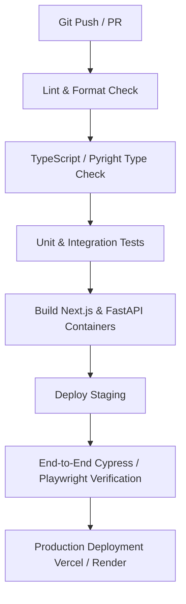

# 13 CI/CD Pipeline Architecture

## GitHub Actions Workflow Summary

## Quality Gates
- Mandatory 80%+ unit test coverage requirement for backend services.
- Zero TypeScript strict compiler errors allowed.
